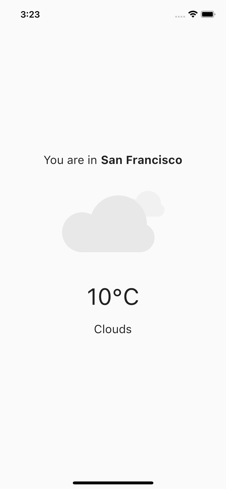

# Weather App



## Description

The Medical UI App.

## Installation

1. Clone the repository:

   ```bash
   git clone REPO_URL
   ```

2. Install the dependencies:

   ```bash
    flutter pub get
   ```

3. Run the app:

   ```bash
    flutter run
   ```

## Technologies

- Flutter
- Dart
